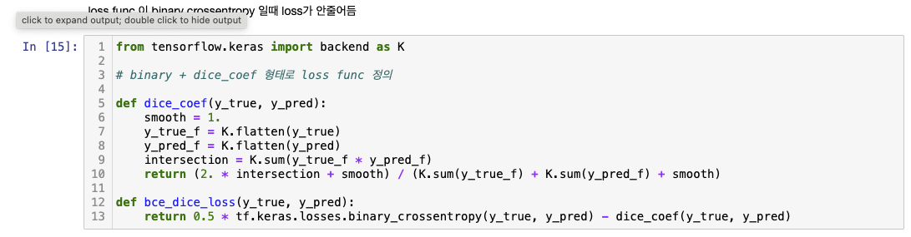
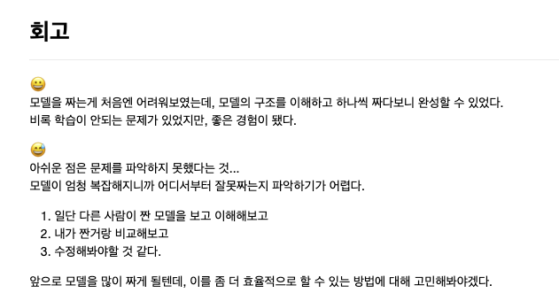

# AIFFEL Campus Online Code Peer Review Templete
- 코더 : 김민규
- 리뷰어 : 정호재


# PRT(Peer Review Template)
- [ ]  **1. 주어진 문제를 해결하는 완성된 코드가 제출되었나요?**
    - 문제에서 요구하는 최종 결과물이 첨부되었는지 확인
    - 문제를 해결하는 완성된 코드란 프로젝트 루브릭 3개 중 2개, 
    퀘스트 문제 요구조건 등을 지칭
        - 1.  U-Net을 통한 세그멘테이션 작업이 정상적으로 진행되었는가? X
        - 2.  U-Net++ 모델이 성공적으로 구현되었는가? X
        - 3.  U-Net과 U-Net++ 두 모델의 성능이 정량적/정성적으로 잘 비교되었는가? X
    
- [X]  **2. 전체 코드에서 가장 핵심적이거나 가장 복잡하고 이해하기 어려운 부분에 작성된 
주석 또는 doc string을 보고 해당 코드가 잘 이해되었나요?**
    - 해당 코드 블럭에 doc string/annotation이 달려 있는지 확인
    - 해당 코드가 무슨 기능을 하는지, 왜 그렇게 짜여진건지, 작동 메커니즘이 뭔지 기술.
    - 주석을 보고 코드 이해가 잘 되었는지 확인
        ```python
        생략
            # Decoder 부분
        x_4_0 = DecoderBlock(x_3_0, [], filters[4])
        x_3_1 = DecoderBlock(x_4_0, [p_3_0], filters[3])
        x_2_2 = DecoderBlock(x_3_1, [p_2_1, p_2_0], filters[2])
        x_1_3 = DecoderBlock(x_2_2, [p_1_2, p_1_1, p_1_0], filters[1])
        i_0_4 =  keras.layers.Concatenate()([x_1_3, p_0_0, p_0_1, p_0_2, p_0_3])
        o_0_4 = keras.layers.Conv2D(num_classes, 1, padding='same', activation='softmax')(i_0_4)

        outputs = keras.layers.Average()([o_0_1, o_0_2, o_0_3, o_0_4])
        UNet_pp_L4 = keras.Model(inputs, outputs)
        ```
        
- [X]  **3. 에러가 난 부분을 디버깅하여 문제를 “해결한 기록을 남겼거나” 
”새로운 시도 또는 추가 실험을 수행”해봤나요?**
    - 문제 원인 및 해결 과정을 잘 기록하였는지 확인
    - 문제에서 요구하는 조건에 더해 추가적으로 수행한 나만의 시도, 
    실험이 기록되어 있는지 확인
        - 
        
- [X]  **4. 회고를 잘 작성했나요?**
    - 주어진 문제를 해결하는 완성된 코드 내지 프로젝트 결과물에 대해
    배운점과 아쉬운점, 느낀점 등이 기록되어 있는지 확인
    - 전체 코드 실행 플로우를 그래프로 그려서 이해를 돕고 있는지 확인  
        - 
        
- [X]  **5. 코드가 간결하고 효율적인가요?**
    - 파이썬 스타일 가이드 (PEP8) 를 준수하였는지 확인  
        네, 준수하였습니다.
    - 하드코딩을 하지않고 함수화, 모듈화가 가능한 부분은 함수를 만들거나 클래스로 짰는지
    - 코드 중복을 최소화하고 범용적으로 사용할 수 있도록 함수화했는지
     ```python
         def ConvBlock(x, n_filters):
            x = keras.layers.Conv2D(n_filters, 3, padding='same')(x)
            x = keras.layers.BatchNormalization()(x)
            x = keras.layers.Activation('relu')(x)
            x = keras.layers.Conv2D(n_filters, 3, padding='same')(x)
            x = keras.layers.BatchNormalization()(x)
            return x

        def EncoderBlock(x, n_filters):
            p = ConvBlock(x, n_filters)
            x = keras.layers.MaxPooling2D(2)(p)
            return x, p 

        def DecoderBlock(x, skip, n_filters):
            x = keras.layers.Concatenate()([x, *skip]) 
            x = ConvBlock(x, n_filters)
            x = UpBlock(x, n_filters)
            return x

        def UpBlock(x, n_filters):
            x = keras.layers.Conv2DTranspose(n_filters, (2, 2), strides=2, padding='same')(x)
    ```
        


# 참고 링크 및 코드 개선
```
# 코드 리뷰 시 참고한 링크가 있다면 링크와 간략한 설명을 첨부합니다.
# 코드 리뷰를 통해 개선한 코드가 있다면 코드와 간략한 설명을 첨부합니다.
```
